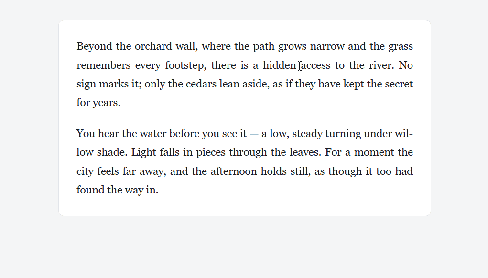
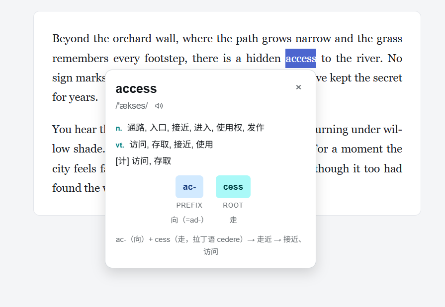
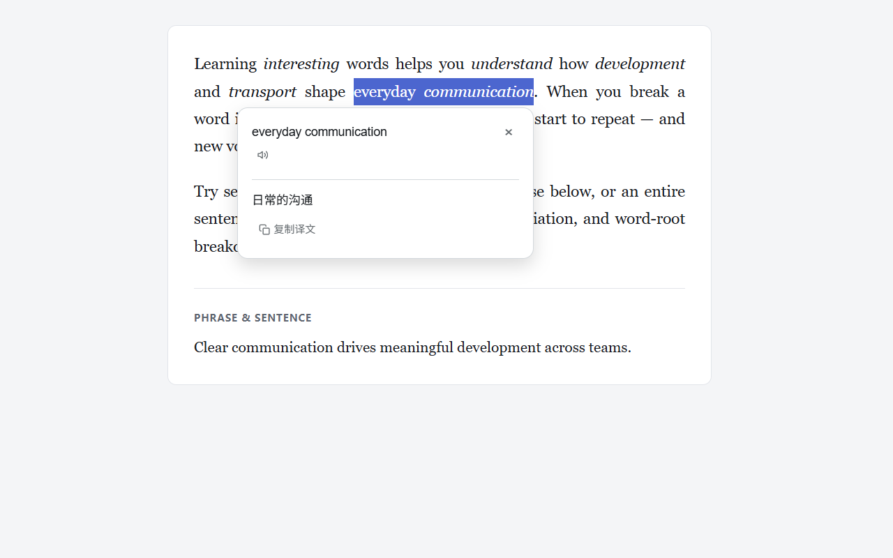
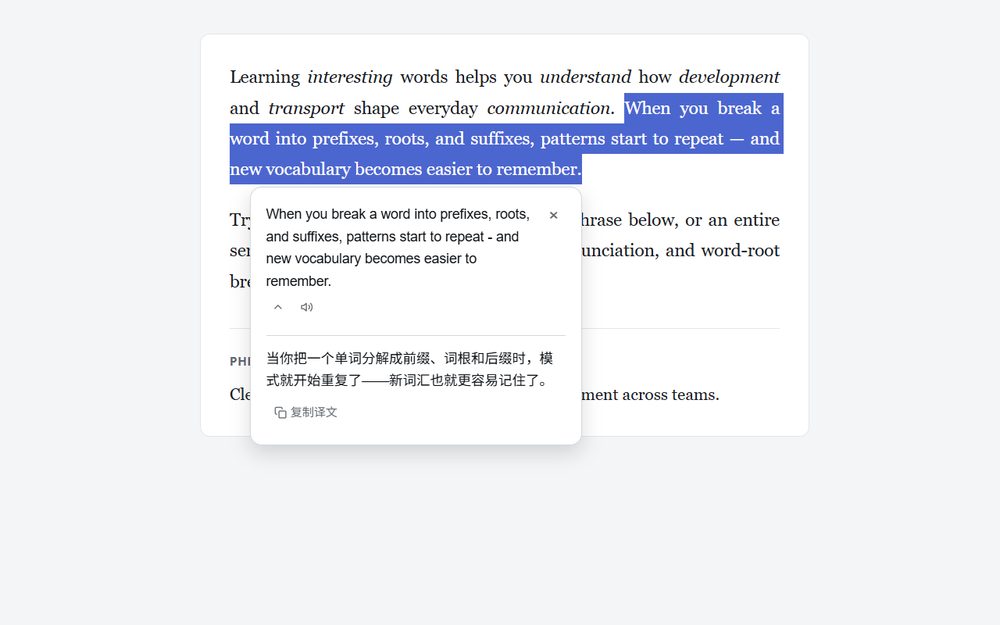
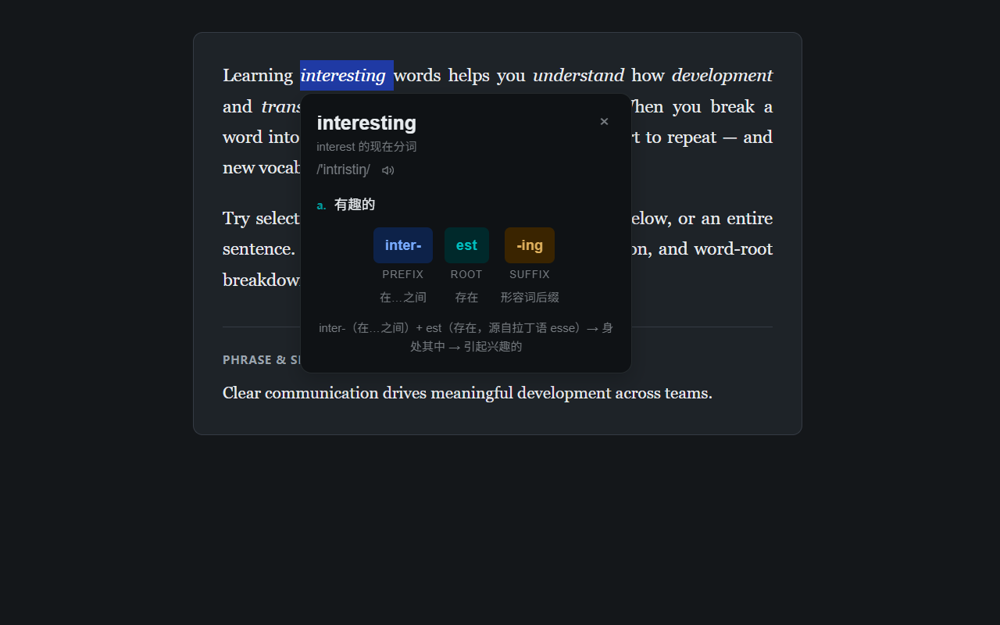
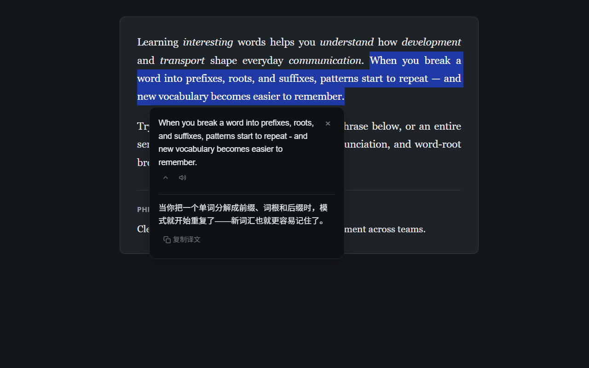

我常用划词翻译插件阅读英文文档，但常见插件都没有词根拆解，于是我做了 puzzledict。

## 功能介绍

安装后，在网页选中英文，点击弹出的小图标，即可查词或翻译。它完全免费，也无需登录注册。

词根释义把单词像拼图一样拆分——这也是 puzzledict 这个名称的由来——拆成前缀、后缀和词根，便于理解和记忆。

例如 access, 就可这样拆 "ac-（向）+ cess（走，拉丁语 cedere）→ 走近 → 接近、访问"。

插件内置了包含 10000 高频词的离线词典，常用词查起来很快，安装后只占 2.8MB。我查词时，大多数情况下不用等。

本地词典以外的词，以及短语句子翻译，则需要联网查询。

查词结果含音标、发音、变体；词根释义覆盖部分高频词，词根库还在扩充。

短语和句子的翻译支持发音、复制译文。

puzzledict 也有夜间模式，能根据网页主题自动适配。

## 灵感来源

之前读 Word Power Made Easy 这本书时，我就领略到了词根的魅力——假如我记住了某个词根，那么就更容易掌握与这个词根相关的一系列词汇。

在某天用不背单词 App 时，我照常点开了词根释义，突然想到，要是划词翻译插件也有词根释义就好了，于是萌生了自己做一个的想法。

经过两个多月，边开发边自用，puzzledict 上线了。

## 结语

我自己一直在使用、优化这个插件，如果你也有兴趣，欢迎试试。

使用过程中，如有任何问题，可在附录中的反馈链接留言。

## 附录

- **安装**：[Chrome 商店](https://chromewebstore.google.com/detail/fjnbhpmpglmpaaehjpjajflmhnifjjoi?utm_source=item-share-cb) · [GitHub 安装包](https://github.com/zhongyangxun/puzzledict/releases) · [备用下载地址](https://download.joeyzcode.com/puzzledict-1.0.0.zip)
- **项目**：[GitHub 仓库](https://github.com/zhongyangxun/puzzledict) · [隐私政策](https://zhongyangxun.github.io/puzzledict/privacy.html)
- **反馈**：[提交 Issue](https://github.com/zhongyangxun/puzzledict/issues) · joeyzcode.dev@gmail.com

**手动安装（离线包）**：解压后，浏览器地址栏打开 `chrome://extensions/`，开启开发者模式，点击”加载已解压的扩展程序“，选择解压文件夹。
