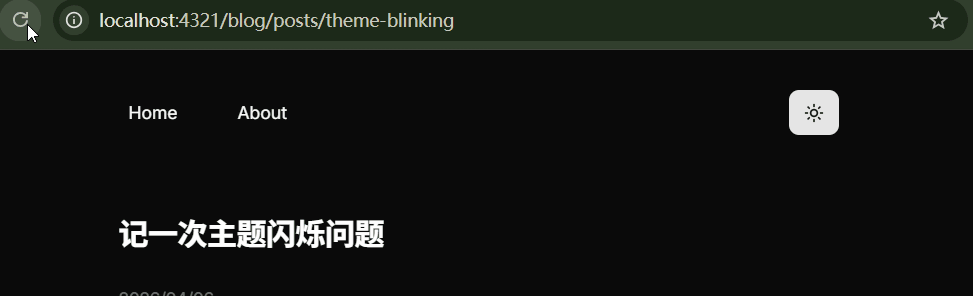
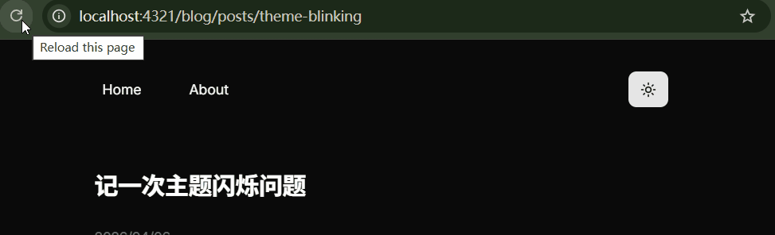
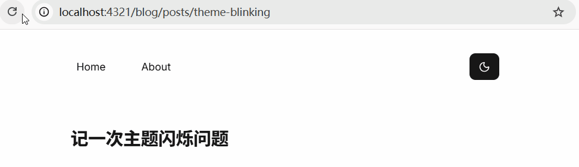
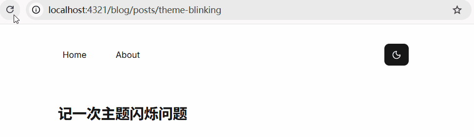
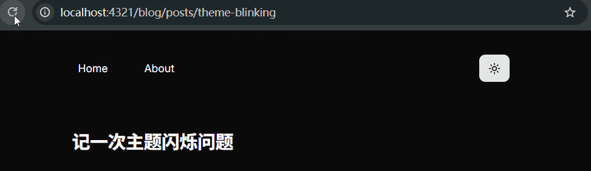

为站点添加亮暗模式切换组件，却在黑暗模式下，遇到主题闪烁的问题，如图：



## 主题初始化

添加切换组件之前，已经做好了亮暗模式的获取，即通过 `window.matchMedia('(prefers-color-scheme: dark)')` 获取信息，由于使用了 [tailwindcss](https://tailwindcss.com/) , 可控制 `document` 节点的 `'dark'` 类名切换页面亮暗模式。

在初始化站点亮暗模式之前，还注册了对 `document` 节点 `class` 变化的监听，根据有无 `'dark'` 类名，将亮暗模式信息持久化储存。

代码如下：

```tsx
const getThemePreference = () => {
  if (typeof localStorage !== 'undefined' && localStorage.getItem('theme')) {
    return localStorage.getItem('theme');
  }
  return window.matchMedia('(prefers-color-scheme: dark)').matches
    ? 'dark'
    : 'light';
};
const isDark = getThemePreference() === 'dark';

if (typeof localStorage !== 'undefined') {
  const observer = new MutationObserver(() => {
    const isDark = document.documentElement.classList.contains('dark');
    localStorage.setItem('theme', isDark ? 'dark' : 'light');
  });
  observer.observe(document.documentElement, {
    attributes: true,
    attributeFilter: ['class'],
  });
}

document.documentElement.classList[isDark ? 'add' : 'remove']('dark');
```

## 主题闪烁

在浏览器暗黑模式下，进入页面，页面已经初始化为暗黑模式。但 `ModeToggle` 组件的渲染引发了主题闪烁。

组件代码如下：

```tsx
import { Button } from '@/components/ui/button';
import { Sun, Moon } from 'lucide-react';
import { useState, useEffect } from 'react';

type Theme = 'light' | 'dark';

const ModeToggle = () => {
  const [theme, setTheme] = useState<Theme>('light');

  useEffect(() => {
    const isDark = document.documentElement.classList.contains('dark');
    setTheme(isDark ? 'dark' : 'light');
  }, []);

  useEffect(() => {
    const docClassList = document.documentElement.classList;
    if (theme === 'dark' && !docClassList.contains('dark')) {
      docClassList.add('dark');
    } else if (theme === 'light' && docClassList.contains('dark')) {
      docClassList.remove('dark');
    }
  }, [theme]);

  const handleClick = () => {
    setTheme(theme === 'light' ? 'dark' : 'light');
  };

  return (
    <Button size="icon" onClick={handleClick}>
      {theme === 'light' ? <Moon /> : <Sun />}
    </Button>
  );
};

export default ModeToggle;
```

分析一下执行流程。

组件将 `theme` 初始化为 `'light'` 。

初次渲染，依次执行组件的两个 `useEffect`。

首先，是依赖项为空数组的 `useEffect`，此时，页面已经为暗黑模式，即 `document` 节点的 `class` 已经包含了 `'dark'` ，所以会执行 `setTheme('dark')` 。

接着依赖项为 `theme` 的 `useEffect`, 会执行 `docClassList.remove('dark')` , 将页面置为日间模式。

接着执行第二次渲染（由第一次渲染的 `setTheme('dark')` 触发），触发依赖项为 `theme` 的 `useEffect` 。

此时，`theme` 为 `'dark'` , `document` 节点也没有了 `'dark'` 类，所以将执行 `docClassList.add('dark')` , 将之前变为日间模式的页面重置为暗黑模式。那个日间模式的持续时间非常短暂，所以就有了动图上看到的闪烁。

很明显，问题就在依赖项为 `theme` 的 `useEffect` 里面将页面置为日间模式的代码。

### 修复

于是我不再将 `theme` 初始化为 `'light'` ，而是给它一个 `null` 值，让依赖值为空的那个 `useEffect` 根据 `document` 的类名来决定设置 `theme` 为 `'light'` 还是 `'dark'` ：

```tsx
//...

type Theme = 'light' | 'dark' | null;

const ModeToggle = () => {
  const [theme, setTheme] = useState<Theme>(null);
  // ...
};
```

这样一来，主题闪烁消失了，暗黑模式下，组件的跳变也不见了，如图：



## 组件跳变问题

但是，又产生了新的问题，如下图，在日间模式下，刷新页面，右侧的 `ModeToggle` 组件会有一个跳变。



组件代码如下：

```tsx
type Theme = 'light' | 'dark' | null;

const ModeToggle = () => {
  const [theme, setTheme] = useState<Theme>(null);

  useEffect(() => {
    const isDark = document.documentElement.classList.contains('dark');
    setTheme(isDark ? 'dark' : 'light');
  }, []);

  useEffect(() => {
    const docClassList = document.documentElement.classList;
    if (theme === 'dark' && !docClassList.contains('dark')) {
      docClassList.add('dark');
    } else if (theme === 'light' && docClassList.contains('dark')) {
      docClassList.remove('dark');
    }
  }, [theme]);

  const handleClick = () => {
    setTheme(theme === 'light' ? 'dark' : 'light');
  };

  return (
    <Button size="icon" onClick={handleClick}>
      {theme === 'light' ? <Moon /> : <Sun />}
    </Button>
  );
};
```

日间模式下的渲染流程如下：

第一次渲染， `theme` 初始值为 `null` 。

依次执行两个 `useEffect` 。依赖项为空数组的 `useEffect` 执行 `setTheme('light')` , 这将触发第二次渲染。由于 `theme` 值为 `null` ，依赖项为 `theme` 的 `useEffect` 不会对主题产生影响。

在组件返回的 JSX 部分，可看到 `theme === 'light' ? <Moon /> : <Sun />` ，由于 `theme` 为 `null` , 此时将渲染 `Sun` 图标，而不是预期的 `Moon` 图标。问题就在这里。

第二次渲染， `theme` 值为 `'light'` 。

执行依赖项为 `theme` 的 `useEffect` , `document` 节点并没有 `'dark'` 类名，页面保持日间主题状态。

在组件返回的 JSX 部分，此时渲染了正确的 `Moon` 图标。

两次渲染了不同的图标，所以会有跳变。

### 修复

那么再添加逻辑判断修复吗？可行是可行。不过既然基于 tailwindcss 的 `'dark'` 类名控制亮暗模式，何不也通过它来控制图标渲染？更准确来说，是通过 CSS 的变形，来确定如何渲染图标。代码如下：

```tsx
const ModeToggle = () => {
  // ...

  return (
    <Button onClick={handleClick}>
      <Sun className="absolute rotate-90 scale-0 transition-all dark:rotate-0 dark:scale-100" />
      <Moon className="rotate-0 scale-100 transition-all dark:-rotate-90 dark:scale-0" />
    </Button>
  );
};
```

可以看到，为两个图标添加了一些类，来控制它们的样式。

`scale` 相关：通过缩放，来控制图标的”显隐“。在日间模式下， `Sun` 图标缩小为 0%，不可见； `Moon` 图标大小为 100%，即初始大小。夜间模式同理。

`absolute` : 让 `Sun` 图标脱离文档流，由 `Moon` 撑起宽高，使得两个图标只占一个图标的空间。由于没有给 `absoulute` 元素设置位置偏移量，所以它的位置参照原本的 `static` 定位。假如不给 `Sun` 设置 `absolute`, 就会产生两个图标大小的空间，如图：


`rotate` 相关：在主题切换时，为图标提供旋转动画，优化体验。

修复效果如下：

日间模式：



夜间模式：


